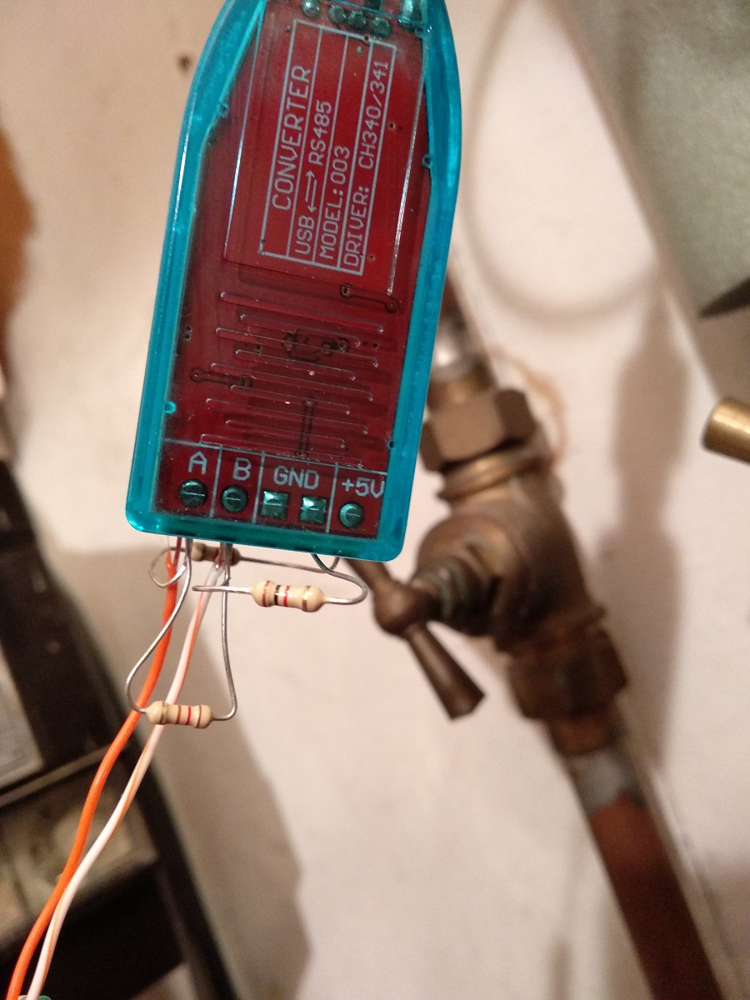
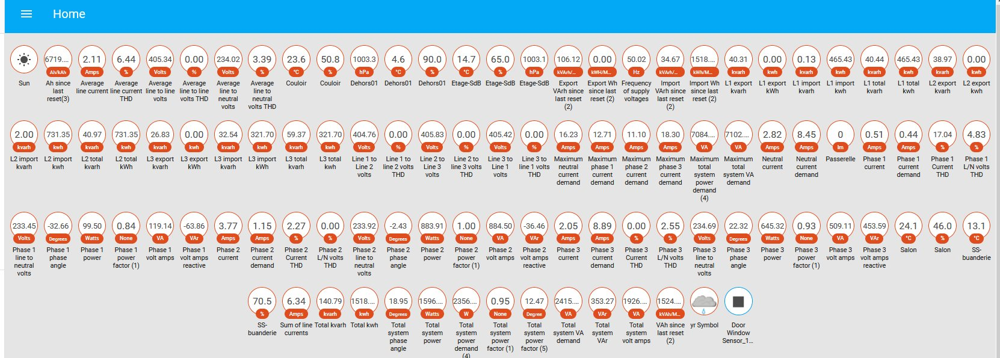
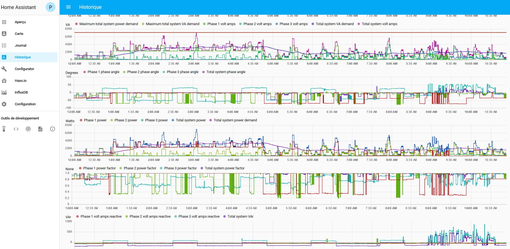

# EASTRON SDM630 configuration file for Home-Assistant

## SDM630

The module can be found on [Aliexpress for about 80€](https://www.aliexpress.com/item/SDM630Modbus-V2-multi-function-power-analyser-1p2w-3p3w-3p4w-modbus-pulse-output-port-RS485-PV-solar/32755125115.html) (shipping included)

Make sure that you get the Modbus version. At that time (25th nov 2018), the last product version is the v2.

## USB to RS485

RS485 is the hardware layer. Modbus is the communication protocol.

You'll need a USB-RS485 module. You can find one on [Aliexpress for 2.5€](https://www.aliexpress.com/item/Industrial-USB-To-RS485-Converter-Upgrade-Protection-RS485-Converter-Compatibility-V2-0-Standard-RS-485-A/32888122294.html).

For the connection, I used:

- 2x 120 Ohms resistor between `A` and `B`, at each end of the cable
- on the USB-RS485 side:
  - 1x 1 kOhm resistor between `A` and `VCC`
  - 1x 1 kOhm resistor between `B` and `GND`



## Home-Assistant

You need to configure the `modbus` module with your own parameters and add the sensors. For convenience, the SDM630 registers are loaded from a separate file [`sdm630_addresses.yaml`](sdm630_addresses.yaml) that needs to be placed in the same directory than your `configuration.yaml` file.

```yaml
modbus:
  - name: SDM630
    type: serial
    method: rtu
    port: /dev/ttyUSB0
    baudrate: 9600
    stopbits: 1
    bytesize: 8
    parity: N
    sensors: !include sdm630_addresses.yaml
```

Once you have restarted Home-Assistant, you should see the sensors on the dashboard.





## Usage

In case you would like to generate the YAML file:

```shell
python3 -m venv venv3
. ./venv3/bin/activate
pip install --upgrade pip
pip install -r requirements.txt
./convert_raw2yml.py
```

The `data.txt` file comes from a simple copy/paste of the datasheet, plus minor manual corrections.
